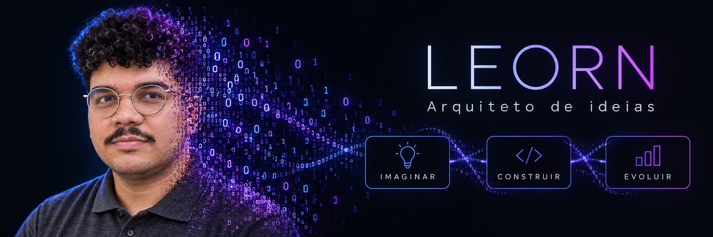
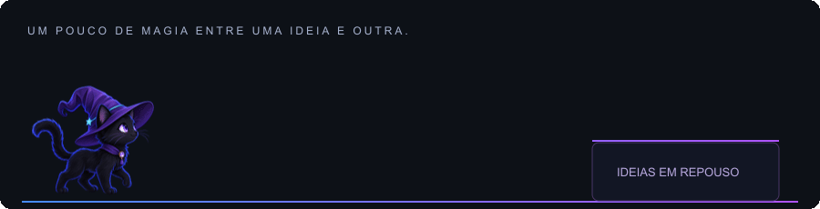

### Ideias ganham forma por aqui.

Sou o Leorn. Exploro a mistura de **criatividade, código e inteligência artificial** para transformar ideias em projetos digitais.

Gosto de imaginar possibilidades, organizar o que precisa ser feito e experimentar até a ideia começar a funcionar. Uso IA como parte do processo e sigo aprendendo com cada construção.

### Como eu crio

**01 · Imaginar** — Encontrar uma ideia e desenhar o que ela pode se tornar.  
**02 · Construir** — Combinar código, ferramentas e IA para tirar a ideia do papel.  
**03 · Evoluir** — Testar, entender os limites e refinar o resultado.

### Projetos em movimento

| Projeto | O que você encontra |
| :--- | :--- |
| **[FinanSee](https://github.com/SrLeorn/FinanSee)** | Aplicativo web progressivo (PWA) FinanSee. |
| **[Pacheco Construções](https://github.com/SrLeorn/PachecoConstrucoes)** | Apresentação dos serviços do profissional Izildo. |
| **[VIA](https://github.com/SrLeorn/VIA)** | Projeto de aplicativo web progressivo (PWA), em sua primeira versão. |

[Todos os repositórios →](https://github.com/SrLeorn?tab=repositories)

### Vamos trocar uma ideia?

[LinkedIn](https://www.linkedin.com/in/srleorn/) · [Instagram](https://www.instagram.com/srleorn/)

